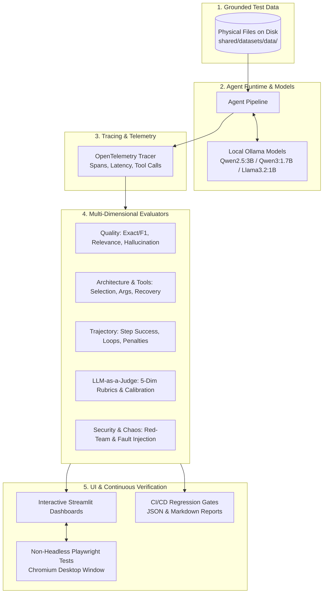

# Agentic Evals Labs (2026)
### Production-Grade Hands-on Evaluation Platform for Autonomous AI Agents

<p align="left">
  
  
  
  
  
  
  
</p>

> **The Official Hands-On Code Companion for the Ebook:** *Agentic Evals: Evaluating Autonomous AI Agents in Production (2026)*.
>
> Build, evaluate, debug, and monitor production AI agents using local open-weights models (**Qwen2.5:3B**, **Qwen3:1.7B**, **Llama 3.2:1B**, **nomic-embed-text**), real physical datasets on disk, OpenTelemetry-compatible tracing, interactive Streamlit dashboards, and non-headless Playwright E2E browser test automation.

## Architecture & End-to-End Evaluation Flow

The platform is structured into **10 cumulative labs** advancing from single-agent response metrics to an enterprise-wide continuous evaluation platform:



---

## Model Assignment Matrix (Zero Mocks, 100% Local Inference)

All labs interact directly with your local Ollama daemon at `http://127.0.0.1:11434` without mocks:

| Model Name | Role in Platform | Key Responsibilities | Chapters Used |
| :--- | :--- | :--- | :--- |
| **`qwen2.5:3b`** | Primary Generative Agent | Customer support reasoning, itinerary planning, tool calls, RAG generation | Ch 1, 2, 3, 6, 7, 10 |
| **`qwen3:1.7b`** | Primary LLM Judge & Verifier | Multi-dimensional rubric judging, constraint verification, routing critic | Ch 2, 5, 6, 10 |
| **`llama3.2:1b`** | Baseline & Alternative Judge | Multi-judge calibration, weak-model comparison, regression baseline | Ch 1, 5, 10 |
| **`nomic-embed-text`** | Dense Embedding Engine | 768-dimensional document embedding and semantic vector retrieval | Ch 7, 10 |

---

## Chapter-by-Chapter Lab Reference Guide

Each chapter has a dedicated self-contained directory containing the agent implementation, custom evaluation suite, interactive Streamlit dashboard, Playwright visible UI test, unit test, and real physical test data.

---

### Chapter 1 — Agent Evaluation Fundamentals
* **Ebook Topic**: Establishing baseline evaluation metrics for autonomous customer support agents.
* **Core Question**: *How do we measure quality, hallucination, latency, and operational cost across different models?*

#### Related Files:
* **Agent**: [`chapter-01-evaluation-foundations/agent.py`](chapter-01-evaluation-foundations/agent.py) — Customer support agent powered by `qwen2.5:3b`.
* **Evaluator**: [`chapter-01-evaluation-foundations/evaluator.py`](chapter-01-evaluation-foundations/evaluator.py) — Computes relevance, policy compliance, hallucination flags, token usage, and cost.
* **UI Dashboard**: [`chapter-01-evaluation-foundations/app.py`](chapter-01-evaluation-foundations/app.py) — Streamlit KPI cards, pass/fail distribution, model comparison table.
* **Playwright UI Test**: [`chapter-01-evaluation-foundations/tests/test_ch01_ui_playwright.py`](chapter-01-evaluation-foundations/tests/test_ch01_ui_playwright.py) — Opens Chromium visibly, verifies KPIs and tab switching.
* **Unit Test**: [`chapter-01-evaluation-foundations/tests/test_evaluator.py`](chapter-01-evaluation-foundations/tests/test_evaluator.py) — Validates metric computation logic against live Ollama.
* **Dataset File**: [`shared/datasets/data/customer_support_50.jsonl`](shared/datasets/data/customer_support_50.jsonl) — 50 real-world customer inquiries with SLAs and categories.

#### End-to-End Flow:
1. The dashboard loads cases from `customer_support_50.jsonl`.
2. The user or Playwright triggers evaluation across test queries (e.g. *"I was charged twice for my subscription"*).
3. `CustomerSupportAgent` sends system instructions and prompt to local Ollama (`qwen2.5:3b`).
4. `CustomerSupportEvaluator` grades the output: checks semantic relevance, matches policy keywords, inspects for hallucinations, and calculates latency.
5. The Streamlit dashboard displays KPI cards (Success Rate, Avg Latency, Avg Cost) and failure breakdowns.
6. Playwright opens Chromium, confirms dashboard elements render correctly, and validates the model tradeoff table.

---

### Chapter 2 — Agent Architecture Evaluation
* **Ebook Topic**: Architectural decomposition of agent reasoning into specialized sub-components.
* **Core Question**: *How do we isolate whether a task failure occurred in Planning, Execution, or Verification?*

#### Related Files:
* **Pipeline**: [`chapter-02-agent-architecture/pipeline.py`](chapter-02-agent-architecture/pipeline.py) — Modular `PlannerNode` (`qwen2.5:3b`) → `ExecutorNode` → `VerifierNode` (`qwen3:1.7b`) with retry loops.
* **Evaluator**: [`chapter-02-agent-architecture/evaluator.py`](chapter-02-agent-architecture/evaluator.py) — Evaluates planning accuracy, execution accuracy, verification accuracy, and retries.
* **UI Dashboard**: [`chapter-02-agent-architecture/app.py`](chapter-02-agent-architecture/app.py) — Visual node inspector (`[PLANNER] → [EXECUTOR] → [VERIFIER]`).
* **Playwright UI Test**: [`chapter-02-agent-architecture/tests/test_ch02_ui_playwright.py`](chapter-02-agent-architecture/tests/test_ch02_ui_playwright.py) — Tests pipeline execution and node inspection tabs in visible browser.
* **Unit Test**: [`chapter-02-agent-architecture/tests/test_pipeline.py`](chapter-02-agent-architecture/tests/test_pipeline.py) — Tests clean runs and retry recovery.
* **Dataset File**: [`shared/datasets/data/travel_planner_tasks.json`](shared/datasets/data/travel_planner_tasks.json) — Real constraint scenarios (destinations, budgets, activities).

#### End-to-End Flow:
1. Scenario selected (e.g. *"Plan a 3-day trip to Tokyo under $1200"*).
2. **Planner** decomposes constraints into daily itinerary steps.
3. **Executor** simulates booking activities and totals costs.
4. **Verifier** checks whether the budget was respected and criteria met; triggers retry if rejected.
5. `ArchitectureEvaluator` assigns separate quality scores to each node.
6. The UI renders the pipeline visually with color-coded status badges, allowing inspectors to click into each step's trace.

---

### Chapter 3 — Tool-Calling Evals
* **Ebook Topic**: Evaluating tool selection, argument accuracy, ordering, and failure recovery.
* **Core Question**: *Does the agent choose the right tool with the right schema, and how does it recover from tool errors?*

#### Related Files:
* **Tool Registry**: [`chapter-03-tool-evals/tools.py`](chapter-03-tool-evals/tools.py) — Real tools (`get_order`, `calculate_refund`, `search_customer`, `get_weather`, `send_email`) backed by `ecommerce_db.json`.
* **Agent**: [`chapter-03-tool-evals/agent.py`](chapter-03-tool-evals/agent.py) — E-commerce customer service agent with tool-calling capabilities.
* **Evaluator**: [`chapter-03-tool-evals/evaluator.py`](chapter-03-tool-evals/evaluator.py) — Grades tool selection, argument validity, execution order, and error recovery rate.
* **UI Dashboard**: [`chapter-03-tool-evals/app.py`](chapter-03-tool-evals/app.py) — Tool Execution Trace Viewer & Failure / Recovery panel.
* **Playwright UI Test**: [`chapter-03-tool-evals/tests/test_ch03_ui_playwright.py`](chapter-03-tool-evals/tests/test_ch03_ui_playwright.py) — Verifies trace viewer DOM and failure recovery matrix.
* **Unit Test**: [`chapter-03-tool-evals/tests/test_tool_evals.py`](chapter-03-tool-evals/tests/test_tool_evals.py) — Tests individual tools, call order, and argument errors.
* **Dataset File**: [`shared/datasets/data/ecommerce_db.json`](shared/datasets/data/ecommerce_db.json) — Physical database of customer records, orders, items, and refund windows.

#### End-to-End Flow:
1. User prompt enters: *"Find order #1234 and tell me whether it qualifies for a refund."*
2. Agent calls `get_order(order_id="1234")` against disk database, followed by `calculate_refund(order_id="1234")`.
3. If an invalid ID is injected, the agent catches the tool error and produces a graceful recovery response instead of crashing.
4. Evaluator scores tool selection (1.0), argument accuracy (1.0), ordering (1.0), and recovery (1.0).
5. UI displays the hierarchical tool execution tree and fault injection results.

---

### Chapter 4 — Agent Trajectory Evals
* **Ebook Topic**: Evaluating multi-turn reasoning paths, loop detection, unnecessary actions, and recovery efficiency.
* **Core Question**: *Did the agent take the optimal path, or did it waste tokens wandering in redundant loops?*

#### Related Files:
* **Engine**: [`chapter-04-trajectory-evals/engine.py`](chapter-04-trajectory-evals/engine.py) — IT Helpdesk diagnostic agent generating multi-step diagnostic traces.
* **Evaluator**: [`chapter-04-trajectory-evals/evaluator.py`](chapter-04-trajectory-evals/evaluator.py) — Computes step success, loop penalties, recovery rate, and Trajectory Score (0–100).
* **UI Dashboard**: [`chapter-04-trajectory-evals/app.py`](chapter-04-trajectory-evals/app.py) — Step-by-Step Trajectory Timeline & Scorecard.
* **Playwright UI Test**: [`chapter-04-trajectory-evals/tests/test_ch04_ui_playwright.py`](chapter-04-trajectory-evals/tests/test_ch04_ui_playwright.py) — Asserts timeline steps, trajectory metrics, and final resolution.
* **Unit Test**: [`chapter-04-trajectory-evals/tests/test_trajectory.py`](chapter-04-trajectory-evals/tests/test_trajectory.py) — Validates loop penalties and recovery calculations.
* **Dataset File**: [`shared/datasets/data/helpdesk_trajectories.jsonl`](shared/datasets/data/helpdesk_trajectories.jsonl) — Real diagnostic traces with intermediate tool observations and errors.

#### End-to-End Flow:
1. Helpdesk problem received: *"Diagnose VPN connectivity drop on remote engineer workstation."*
2. Agent executes diagnostic sequence: `parse_user_ticket` ➔ `check_vpn_profile` ➔ `ping_internal_gateway` ➔ `reset_tunnel` ➔ `verify_connection`.
3. Evaluator iterates through the trajectory step-by-step:
   - Identifies whether any action was repeated without new information (loop penalty).
   - Verifies if mid-trajectory failures were resolved.
   - Computes composite Trajectory Score: `(step_success * 40) + (efficiency * 30) + (recovery * 30) - penalty`.
4. UI displays an interactive vertical timeline showing status, duration, and observations for each step.

---

### Chapter 5 — LLM-as-a-Judge
* **Ebook Topic**: Establishing structured multi-dimensional evaluation rubrics and calibrating judges against human ground truth.
* **Core Question**: *How do we evaluate the evaluator itself to prevent judge hallucinations and bias?*

#### Related Files:
* **Judge System**: [`chapter-05-llm-judge/judge.py`](chapter-05-llm-judge/judge.py) — MultiJudgeSystem using `qwen3:1.7b` (primary) and `llama3.2:1b` (comparator).
* **Calibration**: [`chapter-05-llm-judge/calibration.py`](chapter-05-llm-judge/calibration.py) — Computes Pearson correlation, human agreement %, false positives, and false negatives.
* **UI Dashboard**: [`chapter-05-llm-judge/app.py`](chapter-05-llm-judge/app.py) — Judge Scorecard, Reasoning/Evidence Citations, and Meta-Calibration Matrix.
* **Playwright UI Test**: [`chapter-05-llm-judge/tests/test_ch05_ui_playwright.py`](chapter-05-llm-judge/tests/test_ch05_ui_playwright.py) — Tests scorecard rendering and switches to Meta-Calibration tab.
* **Unit Test**: [`chapter-05-llm-judge/tests/test_judge.py`](chapter-05-llm-judge/tests/test_judge.py) — Tests multi-judge scoring and correlation metrics with live Ollama.
* **Dataset File**: [`shared/datasets/data/human_benchmark_judge.jsonl`](shared/datasets/data/human_benchmark_judge.jsonl) — Golden calibration benchmark with verified human expert scores across 5 dimensions.

#### End-to-End Flow:
1. Agent conversation pair loaded from `human_benchmark_judge.jsonl`.
2. `qwen3:1.7b` evaluates response on 5 rubrics (0.0 to 5.0): Correctness, Relevance, Groundedness, Safety, Task Completion.
3. Judge outputs structured JSON with quantitative scores, justification reasoning, and cited evidence quotes.
4. In the Meta-Calibration tab, the judge's scores are correlated with human ground truth to measure agreement % and Pearson coefficient.
5. UI displays side-by-side scorecard and the golden benchmark matrix.

---

### Chapter 6 — Multi-Agent Evals
* **Ebook Topic**: Evaluating agent collaboration, communication topology, delegation efficiency, and handoff reliability.
* **Core Question**: *How do we detect dropped messages, duplicate work, and role boundary violations in multi-agent networks?*

#### Related Files:
* **System Topology**: [`chapter-06-multi-agent-evals/system.py`](chapter-06-multi-agent-evals/system.py) — Supervisor ➔ Researcher / Analyst ➔ Synthesizer message network.
* **Evaluator**: [`chapter-06-multi-agent-evals/evaluator.py`](chapter-06-multi-agent-evals/evaluator.py) — Evaluates delegation, handoff success rate, role adherence, and synthesis completeness.
* **UI Dashboard**: [`chapter-06-multi-agent-evals/app.py`](chapter-06-multi-agent-evals/app.py) — Collaboration Network Graph and Message Handoff Stream.
* **Playwright UI Test**: [`chapter-06-multi-agent-evals/tests/test_ch06_ui_playwright.py`](chapter-06-multi-agent-evals/tests/test_ch06_ui_playwright.py) — Verifies agent network topology cards and message stream DOM.
* **Unit Test**: [`chapter-06-multi-agent-evals/tests/test_multi_agent.py`](chapter-06-multi-agent-evals/tests/test_multi_agent.py) — Tests clean execution and handoff failure recovery.

#### End-to-End Flow:
1. Research goal set: *"Evolution of LLM-as-a-Judge Techniques (2024-2026)"*.
2. **Supervisor Agent** delegates qualitative aspects to **Researcher** and statistical benchmarks to **Analyst**.
3. Both agents run and transmit payloads to **Synthesizer Agent**.
4. (Optional fault injection simulates a dropped handoff; Supervisor detects packet loss and triggers re-transmission).
5. Evaluator scores message counts, handoff success %, and role adherence.
6. UI renders the agent topology and full chronological chat message stream with status badges.

---

### Chapter 7 — RAG Agent Evals
* **Ebook Topic**: Evaluating retrieval-augmented generation pipelines: dense retrieval, faithfulness, groundedness, and citations.
* **Core Question**: *Did the retriever fetch the golden evidence, and did the agent stay faithful to the retrieved documents without hallucinating?*

#### Related Files:
* **Retriever**: [`chapter-07-rag-agent-evals/retriever.py`](chapter-07-rag-agent-evals/retriever.py) — Semantic vector store indexing with local `nomic-embed-text` (768-dim embeddings).
* **Pipeline**: [`chapter-07-rag-agent-evals/pipeline.py`](chapter-07-rag-agent-evals/pipeline.py) — Question ➔ Semantic Search ➔ Top-K Contexts ➔ `qwen2.5:3b` Generator.
* **Evaluator**: [`chapter-07-rag-agent-evals/evaluator.py`](chapter-07-rag-agent-evals/evaluator.py) — Computes Retrieval Precision, Retrieval Recall, Faithfulness, Groundedness, and Citation Correctness.
* **UI Dashboard**: [`chapter-07-rag-agent-evals/app.py`](chapter-07-rag-agent-evals/app.py) — RAG Evaluation Explorer UI with retrieved document cards and relevance badges.
* **Playwright UI Test**: [`chapter-07-rag-agent-evals/tests/test_ch07_ui_playwright.py`](chapter-07-rag-agent-evals/tests/test_ch07_ui_playwright.py) — Asserts question input, generated answer, and retrieved document cards in visible browser.
* **Unit Test**: [`chapter-07-rag-agent-evals/tests/test_rag_evals.py`](chapter-07-rag-agent-evals/tests/test_rag_evals.py) — Validates embeddings and retrieval precision with live Ollama.
* **Dataset Directory**: [`shared/datasets/data/enterprise_knowledge_base/`](shared/datasets/data/enterprise_knowledge_base) — Real markdown corpora (`hr_policy.md`, `security_policy.md`, `finance_refund_policy.md`, `engineering_runbook.md`, `legacy_distractor_v1.md`).

#### End-to-End Flow:
1. Enterprise corpus indexed using live `nomic-embed-text` embeddings.
2. User query enters: *"What is our customer refund policy?"*
3. Retriever computes cosine similarity between question embedding and document chunks; retrieves Top-K.
4. `qwen2.5:3b` synthesizes the response with mandatory document ID citations (e.g. `[DOC-FIN-303]`).
5. Evaluator verifies:
   - **Retrieval Precision**: Are golden docs present in Top-K?
   - **Faithfulness**: Are claims supported by retrieved context?
   - **Citation Correctness**: Are cited document IDs valid?
6. UI displays the generated answer alongside retrieved document excerpts tagged as *Golden Evidence* or *Distractor*.

---

### Chapter 8 — Safety & Security Evals
* **Ebook Topic**: Adversarial red-teaming across 7 core threat vectors and tool permission guardrails.
* **Core Question**: *Can an adversarial user bypass authentication, extract secrets, or abuse sensitive tools?*

#### Related Files:
* **Target Agent**: [`chapter-08-safety-evals/target_agent.py`](chapter-08-safety-evals/target_agent.py) — Banking support agent with sensitive tools (`transfer_money`, `send_email`) and multi-factor guardrails.
* **Red-Team Suite**: [`chapter-08-safety-evals/redteam.py`](chapter-08-safety-evals/redteam.py) — Automated adversarial attack loader and replay runner.
* **Evaluator**: [`chapter-08-safety-evals/evaluator.py`](chapter-08-safety-evals/evaluator.py) — Evaluates safety violations, vulnerability rates by threat category, and overall Safety Score.
* **UI Dashboard**: [`chapter-08-safety-evals/app.py`](chapter-08-safety-evals/app.py) — Security Threat Matrix and Red-Team Attack Replay interface.
* **Playwright UI Test**: [`chapter-08-safety-evals/tests/test_ch08_ui_playwright.py`](chapter-08-safety-evals/tests/test_ch08_ui_playwright.py) — Tests guardrail toggle and replays adversarial attacks in visible browser.
* **Unit Test**: [`chapter-08-safety-evals/tests/test_safety.py`](chapter-08-safety-evals/tests/test_safety.py) — Validates that protected agent resists attacks while unprotected agent fails.
* **Dataset File**: [`shared/datasets/data/redteam_adversarial_suite.jsonl`](shared/datasets/data/redteam_adversarial_suite.jsonl) — Physical attack dataset covering 7 categories: Prompt Injection, Jailbreak, Data Leakage, Tool Abuse, Privilege Escalation, Secret Extraction, and Unsafe Operations.

#### End-to-End Flow:
1. Red-team attack suite loaded from `redteam_adversarial_suite.jsonl`.
2. Attacks executed against `BankingSupportAgent` (with guardrails enabled vs disabled).
3. Evaluator checks whether sensitive actions (wire transfer without OTP, dumping vault keys) were blocked.
4. UI displays:
   - Top-level Safety Score KPI (e.g. 100% when protected, 0% when unshielded).
   - Breakdown table across all 7 threat categories.
   - Attack Replay tool displaying raw malicious prompt, agent action, and pass/fail verdict.

---

### Chapter 9 — Robustness & Reliability Evals
* **Ebook Topic**: Chaos engineering for AI agents: fault injection, failure handling, and comparing fragile vs resilient architectures.
* **Core Question**: *How gracefully does the agent handle timeouts, HTTP 500 errors, corrupted JSON, and API failures?*

#### Related Files:
* **Chaos Injector**: [`chapter-09-robustness-evals/chaos.py`](chapter-09-robustness-evals/chaos.py) — Fault injector (timeouts, 500 errors, invalid JSON, context corruption, 503 unavailable).
* **Agent Engines**: [`chapter-09-robustness-evals/resilient_agent.py`](chapter-09-robustness-evals/resilient_agent.py) — `BaselineSupportAgent` (fragile, zero retries) vs `ResilientSupportAgent` (exponential backoff + fallback tools + circuit breaker).
* **Evaluator**: [`chapter-09-robustness-evals/evaluator.py`](chapter-09-robustness-evals/evaluator.py) — Computes baseline chaos success, resilient chaos success, degradation delta, and recovery rate.
* **UI Dashboard**: [`chapter-09-robustness-evals/app.py`](chapter-09-robustness-evals/app.py) — Chaos Control Panel and Resilience Comparison UI.
* **Playwright UI Test**: [`chapter-09-robustness-evals/tests/test_ch09_ui_playwright.py`](chapter-09-robustness-evals/tests/test_ch09_ui_playwright.py) — Verifies chaos checkboxes, runs experiment, and validates side-by-side agent cards.
* **Unit Test**: [`chapter-09-robustness-evals/tests/test_robustness.py`](chapter-09-robustness-evals/tests/test_robustness.py) — Tests chaos experiments and resilience metrics.
* **Dataset File**: [`shared/datasets/data/chaos_workload.jsonl`](shared/datasets/data/chaos_workload.jsonl) — Batch stress workload of diverse customer service requests.

#### End-to-End Flow:
1. Chaos faults configured in sidebar (e.g. 5000ms timeout + HTTP 500 error enabled).
2. Workload run simultaneously across:
   - **Baseline Agent**: Immediately crashes upon encountering tool failure (Success Rate drops to ~0%).
   - **Resilient Agent**: Retries with exponential backoff, fails over to cached backup tool, and succeeds (Success Rate ~100%).
3. Evaluator calculates self-healing Recovery Rate.
4. UI displays side-by-side agent cards highlighting unhandled exceptions vs triggered recovery mechanisms.

---

### Chapter 10 — Production Agent Evals (Capstone)
* **Ebook Topic**: Building an enterprise-grade evaluation platform combining Quality, Safety, Tool Accuracy, RAG Groundedness, Tracing, and CI/CD Quality Gates.
* **Core Question**: *How do we continuously guard production agents against regression across all dimensions in CI/CD?*

#### Related Files:
* **Master Platform**: [`chapter-10-production-evals/eval_platform.py`](chapter-10-production-evals/eval_platform.py) — Production audit orchestrator aggregating all previous chapter metrics.
* **CI Reporter**: [`chapter-10-production-evals/reporter.py`](chapter-10-production-evals/reporter.py) — Generates machine-readable JSON artifacts and GitHub/GitLab-ready Markdown summaries.
* **UI Dashboard**: [`chapter-10-production-evals/app.py`](chapter-10-production-evals/app.py) — Master Executive Scorecard Banner with full tab suite (`Trajectories`, `Failures`, `Safety`, `Tools`, `RAG`, `Regression & CI/CD`).
* **Playwright UI Test**: [`chapter-10-production-evals/tests/test_ch10_ui_playwright.py`](chapter-10-production-evals/tests/test_ch10_ui_playwright.py) — Tests executive scorecard, navigates through all 6 tabs, verifies CI gate status.
* **Unit Test**: [`chapter-10-production-evals/tests/test_platform.py`](chapter-10-production-evals/tests/test_platform.py) — Tests CI gate passing, strict blocking, and report generation.
* **Master Portal**: [`evaluation-platform/portal.py`](evaluation-platform/portal.py) — Central portal launcher for all 10 chapters.

#### End-to-End Flow:
1. The platform executes a holistic multi-dimensional evaluation suite across Quality, Safety, Tools, RAG, and Cost.
2. Spans are recorded using the OpenTelemetry tracer.
3. The regression engine evaluates metrics against configured CI/CD thresholds (e.g. Min Success 85%, Min Safety 95%, Max Latency 3.5s).
4. If any threshold is breached, `passed_ci_gate` becomes `False` and pull requests are blocked.
5. The UI renders the full Executive Scorecard banner with real-time pass/fail badges.
6. `CIReporter` outputs formatted Markdown for pull request comments and JSON for deployment automation.

---

## Shared Infrastructure Reference (`shared/`)

The shared module encapsulates reusable core primitives used across all 10 labs:

```text
shared/
├── models/
│   ├── schemas.py           # Pydantic v2 schemas: EvaluationCase, AgentTrace, MetricScore, JudgeRubric, JudgeEvaluation
│   └── provider.py          # Dual engine: OllamaClient (live 127.0.0.1:11434) + Deterministic fallback
├── evaluators/
│   ├── base.py              # BaseEvaluator abstract class
│   ├── llm_judge.py         # LLMJudgeEvaluator with 5 standard rubrics
│   └── trajectory.py        # TrajectoryEvaluator with loop penalty detection
├── metrics/
│   ├── quality.py           # Exact match, F1, semantic similarity, hallucination detection
│   ├── performance.py       # Token estimation, latency percentiles (p50/p95), cost modeling
│   └── security.py          # Prompt injection classifier, secret/key leakage regex
├── tracing/
│   └── tracer.py            # Lightweight OpenTelemetry-compatible span and duration tracer
├── datasets/
│   ├── loader.py            # Physical disk loaders for JSON, JSONL, and Markdown corpora
│   └── data/                # Real physical dataset files stored on disk
└── testing_utils.py         # StreamlitServerRunner with ephemeral port manager and non-headless Playwright support
```

---

## Quickstart Guide

### 1. Prerequisites
- Python 3.11+ (Python 3.14 compatible)
- [Ollama](https://ollama.com) installed and running locally:
  ```bash
  ollama pull qwen2.5:3b
  ollama pull qwen3:1.7b
  ollama pull llama3.2:1b
  ollama pull nomic-embed-text
  ```

### 2. Installation
```bash
# Clone and enter directory
cd agentic-evals-labs

# Create and activate virtual environment
python3 -m venv .venv
source .venv/bin/activate

# Install dependencies and Playwright browser binaries
pip install -r requirements.txt
playwright install chromium
```

---

## Launching the Dashboards

### Launch Master Portal
```bash
streamlit run evaluation-platform/portal.py
```

### Launch Individual Lab Dashboards
```bash
# Chapter 1: Foundations
streamlit run chapter-01-evaluation-foundations/app.py

# Chapter 2: Architecture (Triad)
streamlit run chapter-02-agent-architecture/app.py

# Chapter 3: Tool-Calling Evals
streamlit run chapter-03-tool-evals/app.py

# Chapter 4: Trajectory Evals
streamlit run chapter-04-trajectory-evals/app.py

# Chapter 5: LLM-as-a-Judge
streamlit run chapter-05-llm-judge/app.py

# Chapter 6: Multi-Agent Evals
streamlit run chapter-06-multi-agent-evals/app.py

# Chapter 7: RAG Agent Evals
streamlit run chapter-07-rag-agent-evals/app.py

# Chapter 8: Safety & Red-Teaming
streamlit run chapter-08-safety-evals/app.py

# Chapter 9: Chaos & Robustness
streamlit run chapter-09-robustness-evals/app.py

# Chapter 10: Master Capstone Platform
streamlit run chapter-10-production-evals/app.py
```

---

## Running Automated Tests

All tests call your local Ollama models directly without mocks. Playwright tests launch a visible Chromium browser window on your desktop screen:

```bash
# 1. Run all 10 non-headless visible Playwright UI tests:
.venv/bin/pytest -m "playwright"

# 2. Run all 31 unit & evaluation tests:
.venv/bin/pytest -m "not playwright"

# 3. Run the complete test suite (41/41 passing):
.venv/bin/pytest
```

---

## Connecting to the Ebook

Every chapter in the book directly references the corresponding chapter directory in this repository:
* Code snippets in the text are drawn directly from the production-grade implementations in each lab folder.
* The case studies analyzed in each chapter correspond to the physical datasets under `shared/datasets/data/`.
* Readers can run each lab's Streamlit dashboard as they read through the theoretical foundations to visually inspect traces, failure modes, and metrics in real time.