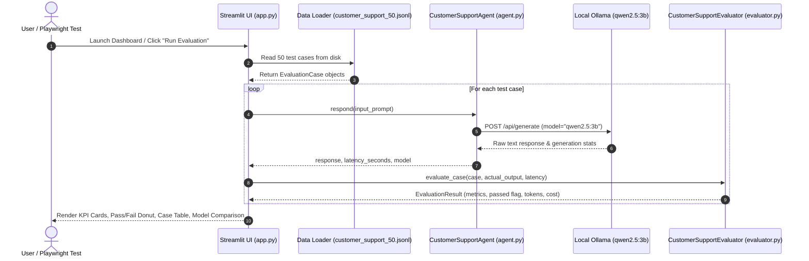

# Chapter 1 — Agent Evaluation Fundamentals
### Lab: Build Your First Agent Evaluation Dashboard

> **Ebook Connection**: Maps to Chapter 1 of *Agentic Evals (2026)*: *Core Evaluation Metrics, Token Accounting, Hallucination Detection, and Model Quality/Latency Tradeoffs*.

---

## 🎯 Lab Objectives
1. Implement a production customer support agent using **Qwen2.5:3B** running locally via Ollama.
2. Build an automated evaluation suite grading **Relevance**, **Policy Adherence**, **Hallucination**, **Task Completion**, and **Latency**.
3. Create an interactive Streamlit evaluation dashboard with real-time KPI metric cards and failure breakdown views.
4. Compare model tradeoffs between `qwen2.5:3b`, `qwen3:1.7b`, and `llama3.2:1b`.
5. Automate end-to-end UI verification using non-headless **Python Playwright** (`pytest-playwright`).

---

## 📁 File Structure

```text
chapter-01-evaluation-foundations/
├── agent.py                 # CustomerSupportAgent implementation with local Ollama runtime
├── evaluator.py             # CustomerSupportEvaluator (Relevance, Hallucination, SLAs, Costs)
├── app.py                   # Streamlit Agent Evaluation Dashboard
├── tests/
│   ├── test_evaluator.py            # Unit test verifying metric calculation with live Ollama
│   └── test_ch01_ui_playwright.py   # Non-headless Playwright E2E browser UI test
└── README.md                # This reference document
```

---

## 🔄 End-to-End Execution Flow



---

## 📊 Evaluation Metrics Computed

| Metric | Formula / Technique | Pass Threshold |
| :--- | :--- | :--- |
| **Relevance** | Token overlap & semantic alignment to user inquiry | $\ge 0.20$ |
| **Helpfulness** | Domain keyword presence (`refund`, `subscription`, `billing`, etc.) | $\ge 0.50$ |
| **Hallucination** | Entity extraction and cross-check against prompt context | $0\text{ violations}$ |
| **Task Completion** | Boolean composite: $(\text{Relevance} \ge 0.2) \land (\text{Helpfulness} \ge 0.5) \land \neg\text{Hallucination}$ | True |
| **Latency** | End-to-end request duration | Benchmark: $\le 3.0\text{s}$ |
| **Operational Cost** | Estimated tokens $\times$ model price tier | $\$0.00$ (local Ollama) |

---

## 🖥️ Running the Lab

### 1. Launch the Interactive Dashboard
```bash
streamlit run chapter-01-evaluation-foundations/app.py
```
* Access at `http://localhost:8501`.
* Select models from the sidebar dropdown (`qwen2.5:3b`, `qwen3:1.7b`, `llama3.2:1b`).
* Adjust the test count slider and click **🚀 Run Evaluation**.

### 2. Run the Automated Tests
```bash
# Run unit test:
.venv/bin/pytest chapter-01-evaluation-foundations/tests/test_evaluator.py -v

# Run visible Playwright UI test:
.venv/bin/pytest chapter-01-evaluation-foundations/tests/test_ch01_ui_playwright.py -v
```
*(The Playwright test will visibly open Chromium on your desktop, verify that the KPI cards load, and switch to the Model Comparison tab).*
