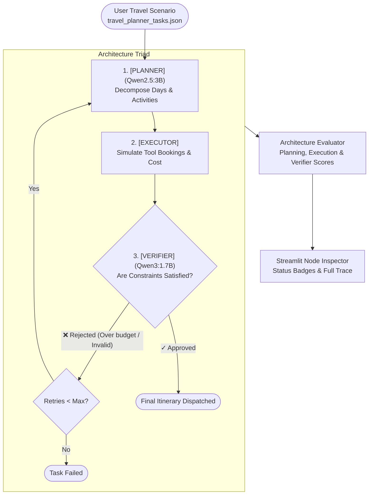

# Chapter 2 — Agent Architecture Evaluation
### Lab: Evaluate the Planner → Executor → Verifier Triad

> **Ebook Connection**: Maps to Chapter 2 of *Agentic Evals (2026)*: *Decomposing Agent Reasoning, Component-Level Failure Isolation, and Self-Correction Loops*.

---

## 🎯 Lab Objectives
1. Implement a structured multi-stage architectural pipeline:
   - **Planner Node** (`qwen2.5:3b`): Decomposes constraints into sub-tasks.
   - **Executor Node**: Carries out the scheduled activities.
   - **Verifier Node** (`qwen3:1.7b`): Validates that budget and destination constraints are satisfied before response dispatch.
2. Build an architectural evaluation engine isolating failures to specific nodes.
3. Measure the impact of retry and self-correction loops when errors are injected into the executor.
4. Visualize pipeline execution in Streamlit with clickable node inspectors.
5. Verify DOM nodes, metrics, and inspector tabs using visible Playwright browser testing.

---

## 📁 File Structure

```text
chapter-02-agent-architecture/
├── pipeline.py              # ArchitecturePipeline (PlannerNode, ExecutorNode, VerifierNode)
├── evaluator.py             # ArchitectureEvaluator (Component & E2E accuracies, retry tracking)
├── app.py                   # Visual Agent Pipeline Inspector UI
├── tests/
│   ├── test_pipeline.py             # Unit tests for clean runs and retry recovery
│   └── test_ch02_ui_playwright.py   # Non-headless Playwright E2E browser UI test
└── README.md                # This reference document
```

---

## 🔄 End-to-End Execution Flow



---

## 📊 Component Evaluation Metrics

| Node / Metric | Evaluation Criteria | Target |
| :--- | :--- | :--- |
| **Planning Accuracy** | Did the planner structure appropriate days, valid destination, and cost estimate? | $1.0\ (100\%)$ |
| **Execution Accuracy** | Did all scheduled actions execute without tool runtime exceptions? | $1.0\ (100\%)$ |
| **Verification Accuracy** | Did the verifier correctly catch injected budget breaches or approve valid plans? | $1.0\ (100\%)$ |
| **E2E Success** | Did the overall pipeline deliver a verified, compliant itinerary? | True |
| **Recovery via Retry** | Did the agent recover on attempt 1 or 2 when the first attempt failed? | $\le 2\text{ retries}$ |

---

## 🖥️ Running the Lab

### 1. Launch the Visual Pipeline Inspector
```bash
streamlit run chapter-02-agent-architecture/app.py
```
* Select travel scenarios from the sidebar (e.g. *Tokyo 3-Day Trip*, *Rome Weekend*).
* Toggle **Inject Executor Failure** to observe self-correction in action.
* Inspect individual node payloads under the **Planner Details**, **Executor Details**, and **Verifier Details** tabs.

### 2. Run the Automated Tests
```bash
# Unit test:
.venv/bin/pytest chapter-02-agent-architecture/tests/test_pipeline.py -v

# Non-headless Playwright UI test:
.venv/bin/pytest chapter-02-agent-architecture/tests/test_ch02_ui_playwright.py -v
```
