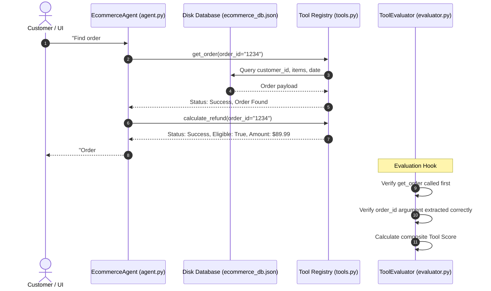

# Chapter 3 — Tool-Calling Evals
### Lab: Tool Calling Evaluation Harness & Trace Viewer

> **Ebook Connection**: Maps to Chapter 3 of *Agentic Evals (2026)*: *Tool Selection Accuracy, Argument Verification, Sequential Execution Constraints, and Error Handling*.

---

## Lab Objectives
1. Implement an e-commerce customer service agent equipped with specialized domain tools.
2. Back tool execution with a **physical JSON relational database** on disk (`ecommerce_db.json`).
3. Build an evaluation engine grading:
   - **Tool Selection**: Choosing the correct tool for the intent.
   - **Argument Accuracy**: Extracting parameters adhering to type and constraint rules.
   - **Tool Order**: Calling prerequisites (e.g. `get_order` before `calculate_refund`).
   - **Failure Recovery**: Graceful handling when tools return errors.
4. Visualize tool execution traces in a hierarchical tree view and dedicated failure panel.
5. Validate tool execution flows via visible non-headless Playwright browser tests.

---

## File Structure

```text
chapter-03-tool-evals/
├── tools.py                 # Tool registry & disk DB functions (get_order, calculate_refund, etc.)
├── agent.py                 # EcommerceCustomerAgent with multi-step tool execution logic
├── evaluator.py             # ToolEvaluator (Selection, Argument Accuracy, Order, Recovery)
├── app.py                   # Streamlit Tool Execution Trace Viewer & Failure Panel
├── tests/
│   ├── test_tool_evals.py           # Unit tests for tools, schemas, and bad argument handling
│   └── test_ch03_ui_playwright.py   # Non-headless Playwright E2E browser UI test
└── README.md                # This reference document
```

---

## End-to-End Execution Flow



---

## Evaluation Criteria & Fault Injection Matrix

| Scenario / Metric | Injected Fault | Expected Behavior |
| :--- | :--- | :--- |
| **Clean Flow** | None | Agent executes `get_order` ➔ `calculate_refund` seamlessly. |
| **Invalid Order ID** | Non-existent ID (`#99999`) | Tool returns `Order not found`. Agent catches error and asks customer for clarification. |
| **Missing Arguments** | Malformed prompt | Agent prompts user for missing order identifier. |
| **Tool Outage** | Simulated exception | Agent falls back to manual ticket creation. |

---

## Running the Lab

### 1. Launch the Tool Trace Viewer
```bash
streamlit run chapter-03-tool-evals/app.py
```
* Select customer tasks from the dropdown.
* Check **Inject Invalid Order ID** to trigger the recovery workflow.
* Inspect the **Tool Execution Trace Viewer** and **Fault Injection Matrix** in real time.

### 2. Run the Automated Tests
```bash
# Unit tests:
.venv/bin/pytest chapter-03-tool-evals/tests/test_tool_evals.py -v

# Non-headless Playwright UI test:
.venv/bin/pytest chapter-03-tool-evals/tests/test_ch03_ui_playwright.py -v
```
