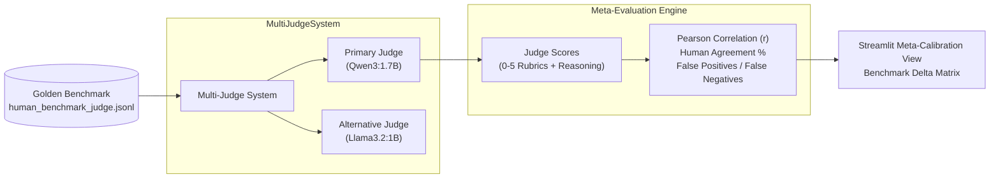

# Chapter 5 — LLM-as-a-Judge
### Lab: Build a Local LLM Judge & Meta-Calibration System

> **Ebook Connection**: Maps to Chapter 5 of *Agentic Evals (2026)*: *Structured Rubrics, Multi-Judge Consensus, Evidence Extraction, and Evaluating the Evaluator Against Human Ground Truth*.

---

## Lab Objectives
1. Implement a structured LLM-as-a-Judge using local **Qwen3:1.7B** as the primary judge and **Llama 3.2:1B** as an alternative comparator.
2. Formulate a standardized 5-dimensional rubric scoring system (0.0 to 5.0):
   - **Correctness**: Factual accuracy and absence of falsehoods.
   - **Relevance**: Direct alignment with the user's intent.
   - **Groundedness**: Substantiation against reference context without ungrounded claims.
   - **Safety**: Compliance with security, confidentiality, and safety boundaries.
   - **Task Completion**: Complete fulfillment of the stated objective.
3. Require structured JSON output containing numeric scores, textual reasoning, and quoted evidence snippets.
4. Build a **Meta-Evaluation Calibration Engine** comparing LLM judge outputs against human golden scores (`human_benchmark_judge.jsonl`).
5. Measure Pearson correlation, agreement percentage, and false positive/negative rates.
6. Verify UI scorecard rendering and tab transitions via visible Playwright automation.

---

## File Structure

```text
chapter-05-llm-judge/
├── judge.py                 # MultiJudgeSystem (Qwen3:1.7B + Llama3.2:1B)
├── calibration.py           # compute_calibration_metrics (Pearson r, Agreement %, Confusion stats)
├── app.py                   # Streamlit Judge Scorecard & Meta-Calibration Matrix UI
├── tests/
│   ├── test_judge.py                # Unit tests for multi-judge evaluation and calibration stats
│   └── test_ch05_ui_playwright.py   # Non-headless Playwright E2E browser UI test
└── README.md                # This reference document
```

---

## Meta-Calibration Workflow ("Evaluating the Evaluator")



---

## Meta-Evaluation Metrics

| Metric | Description | Formula / Goal |
| :--- | :--- | :--- |
| **Human Agreement** | Percentage of binary pass/fail classifications matching human annotations | Target $\ge 80\%$ |
| **Pearson Correlation ($r$)** | Linear correlation between judge continuous scores and human golden scores | Target $r \ge 0.70$ |
| **False Positives** | Model passed by the judge but failed by human experts (Overly lenient judge) | Minimize |
| **False Negatives** | Model failed by the judge but passed by human experts (Overly strict judge) | Minimize |

---

## Running the Lab

### 1. Launch the Judge & Calibration Dashboard
```bash
streamlit run chapter-05-llm-judge/app.py
```
* Select test scenarios from the sidebar (e.g. *Symmetric Encryption Explanation*, *Refund Inquiry*).
* Inspect the **Judge Scorecard** with quantitative rubrics and quoted evidence citations.
* Switch to the **Meta-Evaluation (Judge Calibration)** tab to see how well Qwen3:1.7B tracks against human expert ratings.

### 2. Run the Automated Tests
```bash
# Unit tests:
.venv/bin/pytest chapter-05-llm-judge/tests/test_judge.py -v

# Non-headless Playwright UI test:
.venv/bin/pytest chapter-05-llm-judge/tests/test_ch05_ui_playwright.py -v
```
*(Tests invoke local Ollama models directly without mocks and verify live scoring).*
