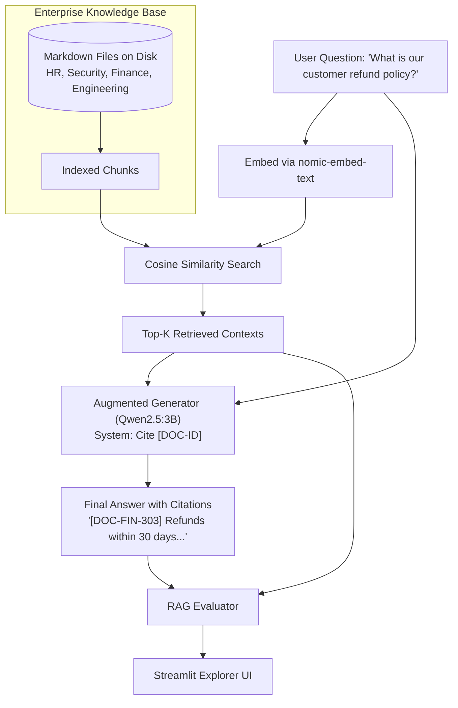

# Chapter 7 — RAG Agent Evals
### Lab: RAG Evaluation Explorer (Dense Retrieval & Faithfulness)

> **Ebook Connection**: Maps to Chapter 7 of *Agentic Evals (2026)*: *Dense Semantic Retrieval, Context Relevance, Faithfulness, Groundedness, and Evidence Citations*.

---

## 🎯 Lab Objectives
1. Build an end-to-end RAG agent pipeline:
   - **Semantic Retriever**: Embeds documents into dense vectors using local **`nomic-embed-text`** (768 dimensions).
   - **Context Indexer**: Indexes real enterprise markdown policies on disk (`shared/datasets/data/enterprise_knowledge_base/`).
   - **Augmented Generator**: Generates answers using local **`qwen2.5:3b`** with strict document citations.
2. Build an automated RAG evaluator measuring:
   - **Retrieval Precision**: Proportion of retrieved chunks containing golden evidence.
   - **Retrieval Recall**: Proportion of required golden documents fetched in Top-K.
   - **Faithfulness**: Absence of ungrounded factual assertions.
   - **Groundedness**: Ratio of claims strictly verifiable against retrieved chunks.
   - **Citation Correctness**: Verification that cited document IDs (e.g. `[DOC-FIN-303]`) exist in the retrieved context.
3. Test retrieval noise resilience by injecting outdated distractor documents (`legacy_distractor_v1.md`).
4. Build a Streamlit **RAG Evaluation Explorer** displaying question, answer, metrics, and document badges.
5. Verify RAG components and DOM elements using visible Playwright browser automation.

---

## 📁 File Structure

```text
chapter-07-rag-agent-evals/
├── retriever.py             # SemanticRetriever using local nomic-embed-text embeddings
├── pipeline.py              # RAGAgentPipeline (Retrieve Top-K -> Prompt Assembly -> Qwen2.5:3B Generation)
├── evaluator.py             # RAGEvaluator (Precision, Recall, Faithfulness, Groundedness, Citations)
├── app.py                   # Streamlit RAG Evaluation Explorer UI
├── tests/
│   ├── test_rag_evals.py            # Unit tests for retriever and RAG evaluation logic
│   └── test_ch07_ui_playwright.py   # Non-headless Playwright E2E browser UI test
└── README.md                # This reference document
```

---

## 🔄 End-to-End RAG Pipeline Flow



---

## 📊 RAG Evaluation Formulas

| Metric | Mathematical Definition | Goal |
| :--- | :--- | :--- |
| **Retrieval Precision** | $\frac{|\text{Retrieved Golden Docs}|}{|\text{Total Retrieved Docs}|}$ | $\ge 0.67$ |
| **Retrieval Recall** | $\frac{|\text{Retrieved Golden Docs}|}{|\text{Total Ground-Truth Golden Docs}|}$ | $1.00\ (100\%)$ |
| **Faithfulness** | $\frac{\text{Number of Claims Supported by Context}}{\text{Total Claims in Answer}}$ | $\ge 0.85$ |
| **Groundedness** | Composite score: $(1 - \text{Hallucination Penalty}) \times \text{Overlap}$ | $\ge 0.90$ |
| **Citation Correctness** | $\frac{\text{Valid Cited Doc IDs in Answer}}{\text{Total Doc IDs Cited}}$ | $1.00\ (100\%)$ |

---

## 🖥️ Running the Lab

### 1. Launch the RAG Evaluation Explorer
```bash
streamlit run chapter-07-rag-agent-evals/app.py
```
* Select enterprise questions from the dropdown (e.g. *Customer Refund Policy*, *Password & MFA Requirements*, *Outage Escalation SLA*).
* Toggle **Inject Distractor & Outdated Docs** to test retriever robustness against noise.
* Inspect the retrieved documents column: golden sources are tagged with `✓ Golden Evidence` while noise files show `✗ Distractor`.

### 2. Run the Automated Tests
```bash
# Unit tests:
.venv/bin/pytest chapter-07-rag-agent-evals/tests/test_rag_evals.py -v

# Non-headless Playwright UI test:
.venv/bin/pytest chapter-07-rag-agent-evals/tests/test_ch07_ui_playwright.py -v
```
