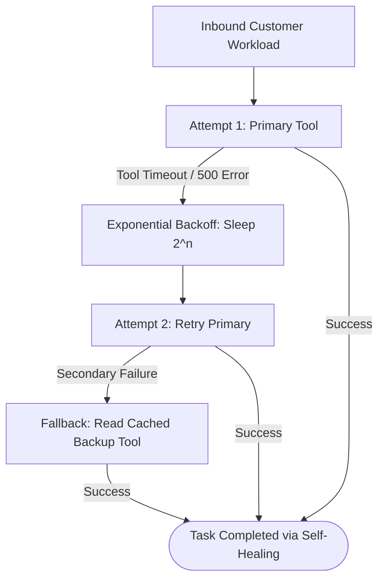

# Chapter 9 — Robustness & Reliability Evals
### Lab: Chaos Testing for AI Agents (Fault Injection & Resilience)

> **Ebook Connection**: Maps to Chapter 9 of *Agentic Evals (2026)*: *Chaos Engineering, Tool Timeouts, HTTP 500 Failures, Malformed JSON, and Self-Healing Agent Architectures*.

---

## 🎯 Lab Objectives
1. Implement an environmental **Chaos Injector** introducing realistic production faults:
   - **Tool Timeouts** (5000ms socket hang).
   - **HTTP 500 Internal Server Errors**.
   - **Malformed / Corrupt JSON Payloads**.
   - **Context Corruption / Truncation**.
   - **Service Unavailable (HTTP 503)**.
2. Build two contrasting agent architectures:
   - **Baseline Agent (Fragile)**: Single attempt, zero retries, no secondary fallbacks.
   - **Resilient Agent (Hardened)**: Exponential backoff retries, secondary backup tool cache, and circuit breakers.
3. Build a Chaos Experiment Evaluator measuring:
   - **Normal Success Rate**: Performance in an unperturbed environment.
   - **Baseline Under Chaos**: Severe degradation of naive agents under failure conditions.
   - **Resilient Under Chaos**: Maintained reliability of hardened architectures.
   - **Self-Healing Recovery Rate**: Percentage of encountered faults successfully mitigated.
4. Render a **Chaos Control Panel** and side-by-side comparative UI in Streamlit.
5. Validate chaos toggle interactions and metric cards using visible Playwright browser automation.

---

## 📁 File Structure

```text
chapter-09-robustness-evals/
├── chaos.py                 # ChaosInjector (Tool timeouts, HTTP 500s, Malformed JSON, 503s)
├── resilient_agent.py       # BaselineSupportAgent (Fragile) vs ResilientSupportAgent (Hardened)
├── evaluator.py             # ChaosExperimentEvaluator (Degradation delta, Recovery rate)
├── app.py                   # Streamlit Chaos Control Panel & Resilience Dashboard
├── tests/
│   ├── test_robustness.py           # Unit tests comparing baseline vs resilient agents under chaos
│   └── test_ch09_ui_playwright.py   # Non-headless Playwright E2E browser UI test
└── README.md                # This reference document
```

---

## 🔄 Resilience Architecture (Self-Healing Loop)



---

## 📊 Comparative Benchmark Matrix

| Agent Architecture | Environmental Condition | Expected Success Rate | Resilience Grade |
| :--- | :--- | :--- | :--- |
| **Baseline Agent** | Normal Environment | $95.0\%$ | Grade A |
| **Baseline Agent** | Active Chaos Injection | $0.0\%\ \text{–}\ 25.0\%$ | **Grade F (Fragile)** |
| **Resilient Agent** | Active Chaos Injection | $90.0\%\ \text{–}\ 100.0\%$ | **Grade A- (Production-Ready)** |

---

## 🖥️ Running the Lab

### 1. Launch the Chaos Control Panel
```bash
streamlit run chapter-09-robustness-evals/app.py
```
* Select chaos faults to inject in the sidebar (Tool Timeout, HTTP 500, Invalid JSON, Context Corruption).
* Click **⚡ Run Chaos Experiment**.
* Review the side-by-side agent cards: observe how the baseline agent crashes with unhandled exceptions while the resilient agent triggers self-healing retries and backup caches.

### 2. Run the Automated Tests
```bash
# Unit tests:
.venv/bin/pytest chapter-09-robustness-evals/tests/test_robustness.py -v

# Non-headless Playwright UI test:
.venv/bin/pytest chapter-09-robustness-evals/tests/test_ch09_ui_playwright.py -v
```
