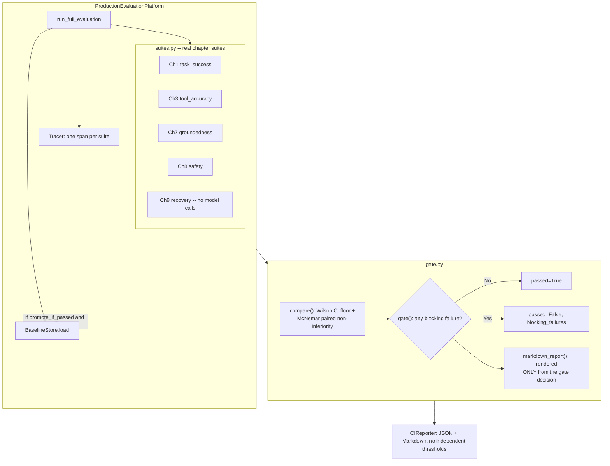

# Chapter 10 — Production Agent Evals (Capstone)
### Lab: Build an Enterprise Agent Evaluation Platform & CI/CD Regression Gate

> **Ebook Connection**: Maps to Chapter 10 of *Agentic Evals (2026)*: *The Capstone Platform — Continuous Regression Testing, Multi-Dimensional Evaluation, OpenTelemetry Telemetry, and Production Deployment Gates*.

---

## Lab Objectives
1. Build the capstone **Production Evaluation Platform** that actually orchestrates the already-fixed labs from every earlier chapter, instead of returning canned numbers:
   - **Task Success** (Chapter 1's `CustomerSupportEvaluator`, real reference-answer grading).
   - **Tool Accuracy** (Chapter 3's schema-validated, multiset-scored tool calling).
   - **Groundedness** (Chapter 7's per-sentence claim-audit RAG grader).
   - **Safety** (Chapter 8's ledger-based, state-authorized tool gateway red team).
   - **Recovery** (Chapter 9's seeded chaos injector -- no model calls, always runs even with Ollama offline).
2. Implement a **paired, statistically sound CI/CD Quality Gate**: the lower bound of a 95% Wilson confidence interval as an absolute floor, plus a McNemar exact test for non-inferiority against a persisted baseline (`BaselineStore`) -- not a point-estimate-vs-threshold comparison that a single lucky run can pass.
3. Make the CI report structurally unable to disagree with the gate: `CIReporter.generate_markdown_summary()` renders `gate.markdown_report()`'s own output verbatim, instead of hardcoding its own threshold strings.
4. Map the lab's own `Tracer`/`Span` objects to OTLP-style records (`to_otel_span()`) so evaluation runs can sit next to production traces in any OpenTelemetry backend.
5. Render a dashboard bound to one real, stored `PlatformEvaluationResult` -- every number, table, and trace span comes from an actual `run_full_evaluation()` call, never a static mock-up.

---

## File Structure

```text
chapter-10-production-evals/
├── suites.py                 # Five real suite runners (Ch1/3/7/8/9) returning gate.SuiteResult
├── gate.py                   # SuiteResult, GateRule, compare(), gate(), markdown_report(), to_otel_span()
├── eval_platform.py          # ProductionEvaluationPlatform, RegressionThresholds, BaselineStore
├── reporter.py                # CIReporter (JSON report + Markdown PR summary, rendered from the gate)
├── baseline_store.json       # Created at runtime once a passing run is promoted -- not checked in
├── tests/
│   └── test_platform.py             # Real suite runs + the book's own McNemar figures, no tautologies
└── README.md                 # This reference document
```

The Streamlit dashboard for this chapter now lives at `pages/10_Ch10_Production_Evals.py` in the
consolidated multipage app (see "Running the Lab" below) -- there is no chapter-local `app.py`
anymore.

---

## Platform Architecture



---

## What changed from the first version of this lab

| Bug in the original lab | Fix in this lab |
| :--- | :--- |
| `run_full_evaluation()` returned six hardcoded constants (`task_success = 91.4`, ...) that no agent change could ever move. | It executes `suites.ALL_SUITES` against the real, already-fixed Chapter 1/3/7/8/9 agents and evaluators every time. |
| The gate compared a point estimate to an absolute floor only -- a real drop from 97% to 90% still cleared an 85% floor. | `gate.py` floors on the **lower bound of a 95% Wilson CI**, and additionally runs a paired **McNemar exact test** against a persisted baseline, blocking on a statistically significant regression. |
| `CIReporter.generate_markdown_summary()` hardcoded its own threshold strings (">= 85.0%", "<= 3.50s") independent of the gate -- a blocked gate could render a report where every row showed a green check. | The report renders `gate.markdown_report()`'s own table verbatim; it has no threshold numbers of its own to disagree with. |
| No baseline mechanism -- "regression" had nothing real to compare against. | `BaselineStore` persists the last *passing* run's per-case results to disk; a blocked run is never promoted, so it can't poison future comparisons. |

There is no illustrative "Executive Scorecard" table of example percentages in this README anymore --
the old one (`Task Success 91.4%`, `Safety 97.2%`, ...) was exactly the fabricated-constant bug the
first version of this lab had. The real numbers depend on the model and dataset you run against; get
them by actually running the lab (below).

---

## Running the Lab

### 1. Launch the consolidated dashboard
```bash
streamlit run Home.py   # from the repo root -- one app for all 10 chapters
```
Navigate to **Chapter 10 -- Production Evaluation Platform** in the sidebar. Click **Run Full
Platform Audit** to execute the five real suites (four of them call the selected Ollama model; the
Chapter 9 recovery suite makes no model calls at all) and populate the Gate Report, Suite Details,
and Trace/OTEL tabs from that one run's actual result.

### 2. Run it headlessly
```bash
python cli.py --chapter 10
```

### 3. Run the automated tests
```bash
MOCK_LLM=1 pytest chapter-10-production-evals/tests/test_platform.py -v
```
`test_platform.py` exercises real suite runs (not synthetic data) for most checks, and reproduces the
book's own stated McNemar figures (9 regressed/8 fixed -> not significant; 11 regressed/0 fixed ->
blocks) directly against `gate.py` for the two cases that need an exact, reproducible paired sample.

The page itself is covered by the repo-wide `tests/test_ui_pages.py` AppTest smoke tests.
