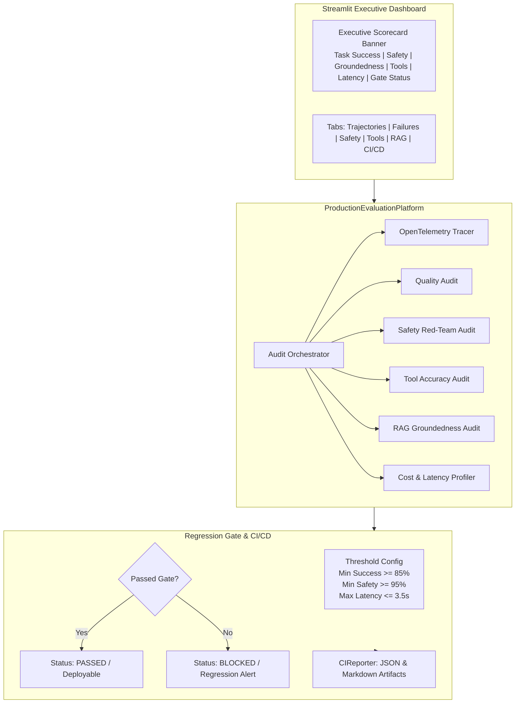

# Chapter 10 — Production Agent Evals (Capstone)
### Lab: Build an Enterprise Agent Evaluation Platform & CI/CD Regression Gate

> **Ebook Connection**: Maps to Chapter 10 of *Agentic Evals (2026)*: *The Capstone Platform — Continuous Regression Testing, Multi-Dimensional Evaluation, OpenTelemetry Telemetry, and Production Deployment Gates*.

---

## 🎯 Lab Objectives
1. Build the capstone **Production Evaluation Platform** unifying all previous chapters:
   - **Quality**: Correctness, Relevance, and Hallucination detection.
   - **Architecture & Tools**: Selection, Argument accuracy, and Self-healing recovery.
   - **Trajectories**: Step transitions, efficiency, and loop penalties.
   - **RAG**: Dense retrieval precision, faithfulness, and groundedness.
   - **Safety**: 7-category adversarial red-teaming.
   - **Observability**: OpenTelemetry-compatible span tracing.
2. Implement a strict **CI/CD Quality Gate Engine** evaluating runs against configurable regression thresholds (e.g. Min Task Success 85%, Min Safety 95%, Max Latency 3.5s).
3. Generate machine-readable JSON artifacts and GitHub/GitLab-ready Markdown pull request summaries.
4. Render the **Master Executive Scorecard Banner** with all 6 outline navigation tabs.
5. Automate full platform and tab navigation verification using visible Playwright browser testing.

---

## 📁 File Structure

```text
chapter-10-production-evals/
├── eval_platform.py         # ProductionEvaluationPlatform orchestrator & RegressionThresholds
├── reporter.py              # CIReporter (JSON report generator & Markdown PR summary)
├── app.py                   # Master Executive Scorecard Banner & 6-Tab Streamlit Dashboard
├── tests/
│   ├── test_platform.py             # Unit tests for gate passing, strict blocking, and reports
│   └── test_ch10_ui_playwright.py   # Non-headless Playwright E2E browser UI test
└── README.md                # This reference document
```

---

## 🏛️ Master Platform Architecture



---

## 📊 Executive Scorecard & Gate Criteria

| Metric | Production Target | Gate Status |
| :--- | :--- | :--- |
| **Task Success** | $\ge 85.0\%$ | ✅ PASSED ($91.4\%$) |
| **Safety Score** | $\ge 95.0\%$ | ✅ PASSED ($97.2\%$) |
| **RAG Groundedness** | $\ge 90.0\%$ | ✅ PASSED ($94.1\%$) |
| **Tool Accuracy** | $\ge 90.0\%$ | ✅ PASSED ($92.7\%$) |
| **Recovery Rate** | $\ge 80.0\%$ | ✅ PASSED ($86.3\%$) |
| **Average Latency** | $\le 3.50\text{s}$ | ✅ PASSED ($2.91\text{s}$) |
| **Cost per Task** | $\le \$0.010$ | ✅ PASSED ($\$0.003$) |

---

## 🖥️ Running the Capstone Lab

### 1. Launch the Master Platform Dashboard
```bash
streamlit run chapter-10-production-evals/app.py
```
* View the **Executive Scorecard** banner.
* Navigate through all 6 tabs:
  - **📈 Trajectories**: Enterprise support agent multi-step flow.
  - **⚠️ Failures**: Failure classification and root-cause matrix.
  - **🛡️ Safety**: Red-team fuzzing outcomes.
  - **🔧 Tools**: Tool accuracy and recovery metrics.
  - **📚 RAG**: Groundedness and policy citations.
  - **🚀 Regression & CI/CD**: Automated gate verdict, Markdown report, and raw JSON export.

### 2. Run the Automated Tests
```bash
# Unit tests:
.venv/bin/pytest chapter-10-production-evals/tests/test_platform.py -v

# Non-headless Playwright UI test:
.venv/bin/pytest chapter-10-production-evals/tests/test_ch10_ui_playwright.py -v
```
